# Hey there 👋 ! I'm Sahil K.

## Find me ↘

📝 [Blogs: sahilk027-blog.vercel.app](https://sahilk027-blog.vercel.app/)

🎬 [Showcases/Devlogs at: Youtube-@SahilK-027](https://www.youtube.com/@SahilK-027)

💼 [Linkedin-sahilk027](https://www.linkedin.com/in/sahilk027/)

🐦 [Twitter-@SahilK027](https://x.com/SahilK027)

<!-- PROJECT-TABLE-START -->
## Projects 19 ↘

<table>
<tr>
<td align="center"><a href="https://glsl-curl-noise.vercel.app/">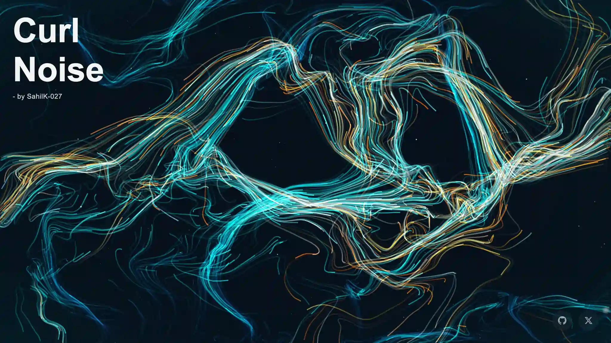</a> ⎯⎯⎯⎯ <strong>Curl Noise</strong> <a href="https://github.com/SahilK-027/glsl-curl-noise">Code</a> · <a href="https://glsl-curl-noise.vercel.app/">Live</a></td>
<td align="center"><a href="https://the-erdtree.vercel.app/">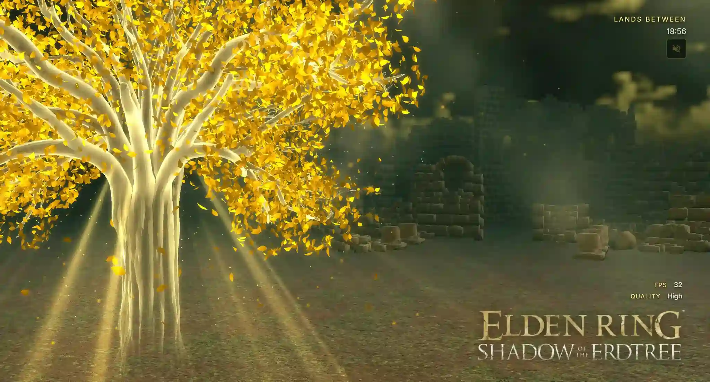</a> ⎯⎯⎯⎯ <strong>The Erdtree</strong> <a href="https://github.com/SahilK-027/The-Erdtree">Code</a> · <a href="https://the-erdtree.vercel.app/">Live</a></td>
<td align="center"><a href="https://digital-brain-sk.vercel.app/">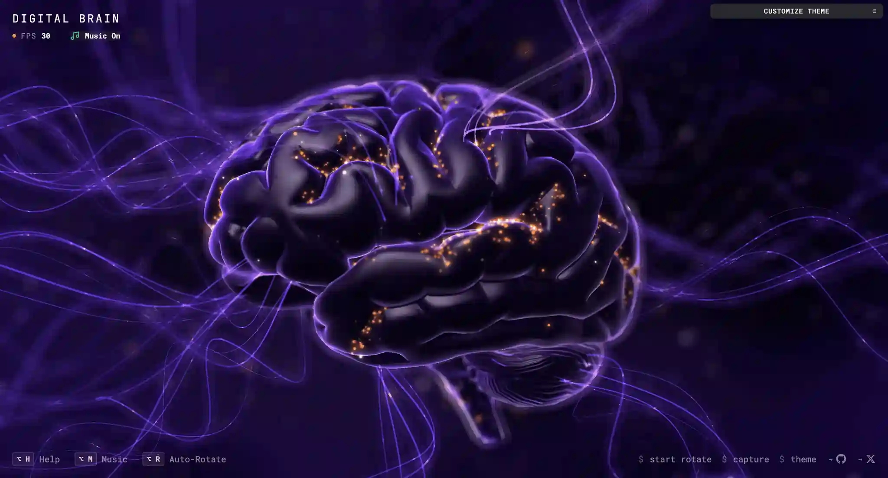</a> ⎯⎯⎯⎯ <strong>Digital Brain</strong> <a href="https://github.com/SahilK-027/Digital-Brain">Code</a> · <a href="https://digital-brain-sk.vercel.app/">Live</a></td>
</tr>
<tr>
<td align="center"><a href="https://cyber-ocean.vercel.app/">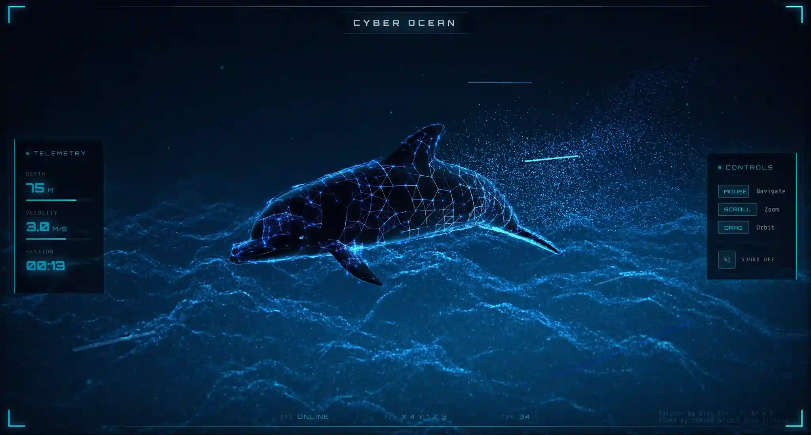</a> ⎯⎯⎯⎯ <strong>Cyber Ocean</strong> <a href="https://github.com/SahilK-027/Cyber-Ocean">Code</a> · <a href="https://cyber-ocean.vercel.app/">Live</a></td>
<td align="center"><a href="https://crystal-bird.vercel.app/">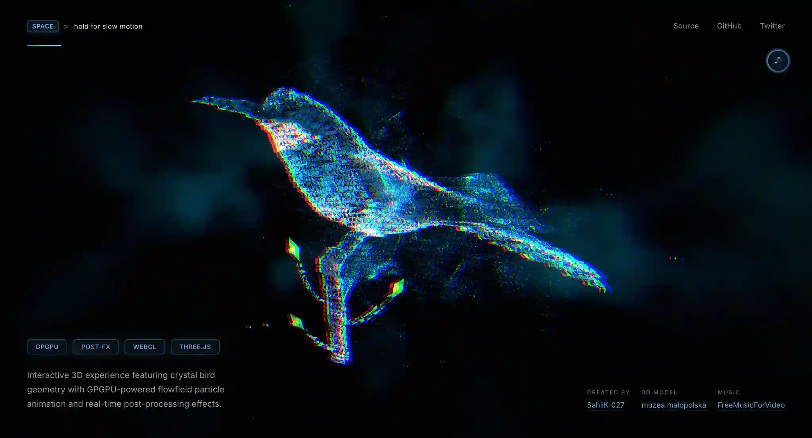</a> ⎯⎯⎯⎯ <strong>Crystal Bird</strong> <a href="https://github.com/SahilK-027/Crystal-Bird">Code</a> · <a href="https://crystal-bird.vercel.app/">Live</a></td>
<td align="center"><a href="https://elemental-serenity.vercel.app/">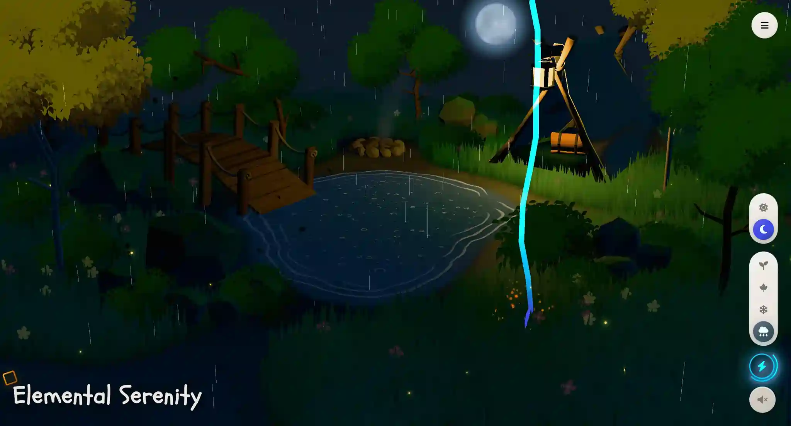</a> ⎯⎯⎯⎯ <strong>Elemental Serenity</strong> <a href="https://github.com/SahilK-027/Elemental-Serenity">Code</a> · <a href="https://elemental-serenity.vercel.app/">Live</a></td>
</tr>
<tr>
<td align="center"><a href="https://celestial-drift.vercel.app/">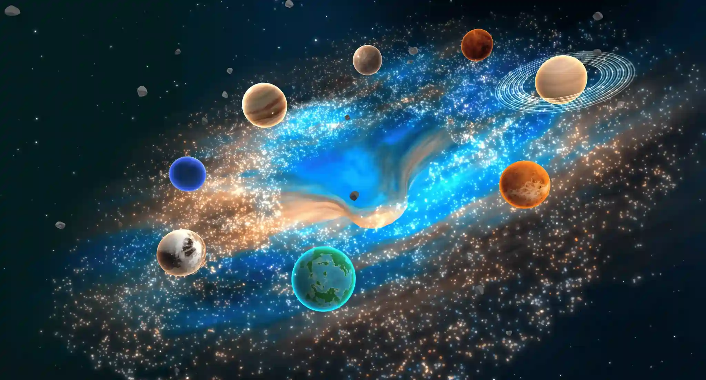</a> ⎯⎯⎯⎯ <strong>Celestial Drift</strong> <a href="https://github.com/SahilK-027/Celestial-Drift">Code</a> · <a href="https://celestial-drift.vercel.app/">Live</a></td>
<td align="center"><a href="https://space-distortion-sk027.vercel.app/">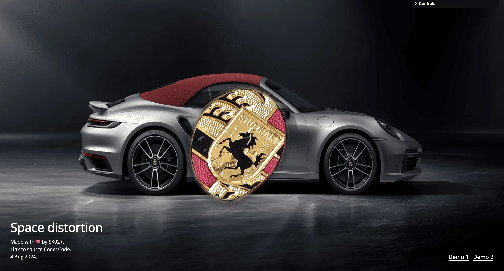</a> ⎯⎯⎯⎯ <strong>Space Distortion</strong> <a href="https://github.com/SahilK-027/0x7444ff/tree/main/space-distortion">Code</a> · <a href="https://space-distortion-sk027.vercel.app/">Live</a></td>
<td align="center"><a href="https://iron-man-sk027.vercel.app/">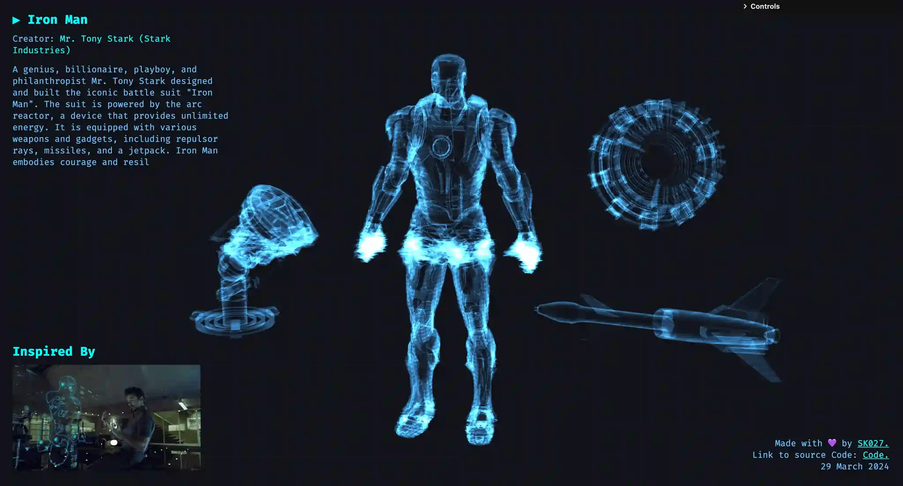</a> ⎯⎯⎯⎯ <strong>Holograms</strong> <a href="https://github.com/SahilK-027/0x7444ff/tree/main/iron-man-hologram">Code</a> · <a href="https://iron-man-sk027.vercel.app/">Live</a></td>
</tr>
<tr>
<td align="center"><a href="https://particles-gpgpu-sk027.vercel.app/">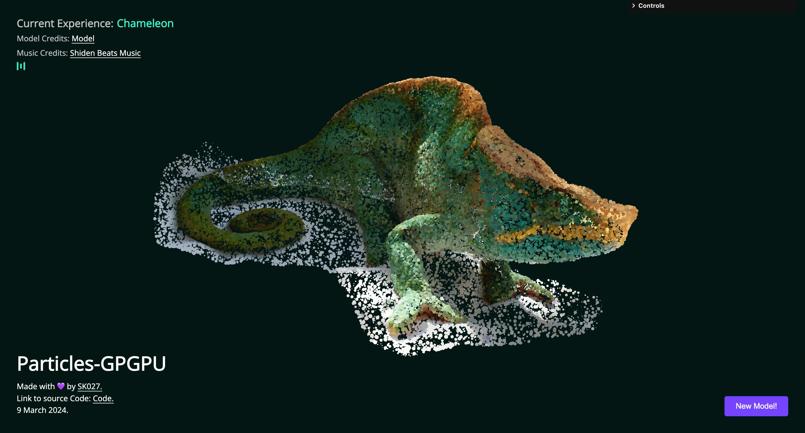</a> ⎯⎯⎯⎯ <strong>GPGPU Particles</strong> <a href="https://github.com/SahilK-027/0x7444ff/tree/main/particles-GPGPU">Code</a> · <a href="https://particles-gpgpu-sk027.vercel.app/">Live</a></td>
<td align="center"><a href="https://0x7444ff-perlin-noise-advanced-abstract-pattern.vercel.app/">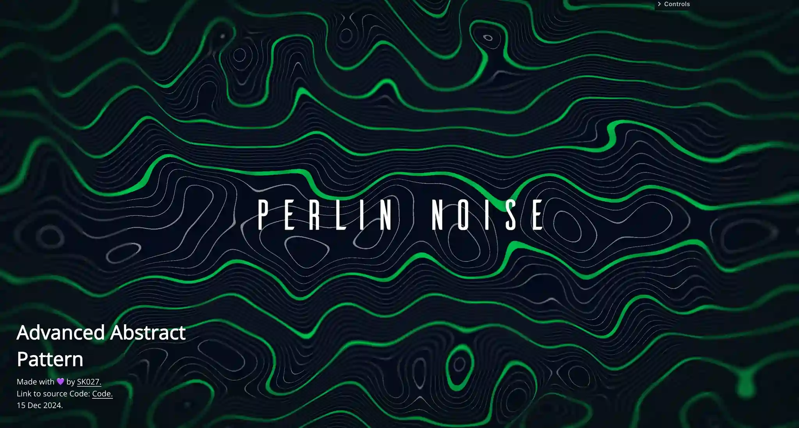</a> ⎯⎯⎯⎯ <strong>Perlin Pattern</strong> <a href="https://github.com/SahilK-027/0x7444ff/tree/main/perlin-noise-advanced-abstract-pattern">Code</a> · <a href="https://0x7444ff-perlin-noise-advanced-abstract-pattern.vercel.app/">Live</a></td>
<td align="center"><a href="https://frosted-canvas.vercel.app/">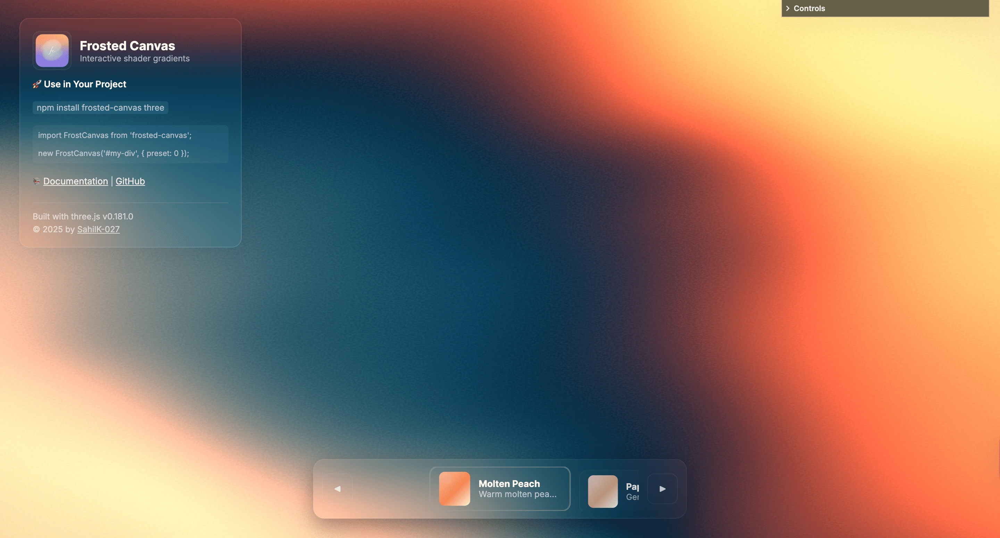</a> ⎯⎯⎯⎯ <strong>Frosted Canvas</strong> <a href="https://github.com/SahilK-027/Frosted-Canvas">Code</a> · <a href="https://frosted-canvas.vercel.app/">Live</a></td>
</tr>
<tr>
<td align="center"><a href="https://minecraft-sahilk.vercel.app/">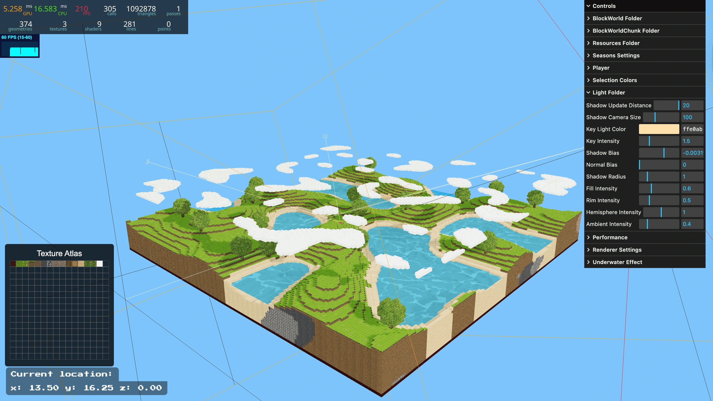</a> ⎯⎯⎯⎯ <strong>Minecraft</strong> <a href="https://github.com/SahilK-027/My-Minecraft">Code</a> · <a href="https://minecraft-sahilk.vercel.app/">Live</a></td>
<td align="center"><a href="https://neon-christmas-sk027.vercel.app/">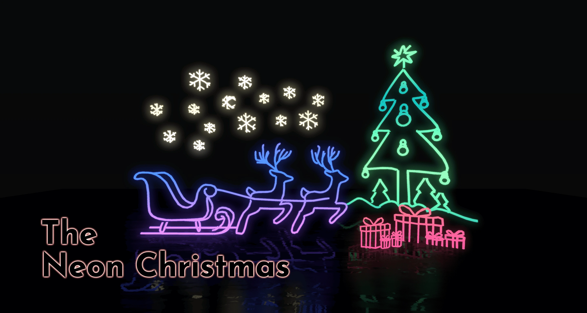</a> ⎯⎯⎯⎯ <strong>Neon Christmas</strong> <a href="https://github.com/SahilK-027/neon-christmas">Code</a> · <a href="https://neon-christmas-sk027.vercel.app/">Live</a></td>
<td align="center"><a href="https://sk027v2.vercel.app/">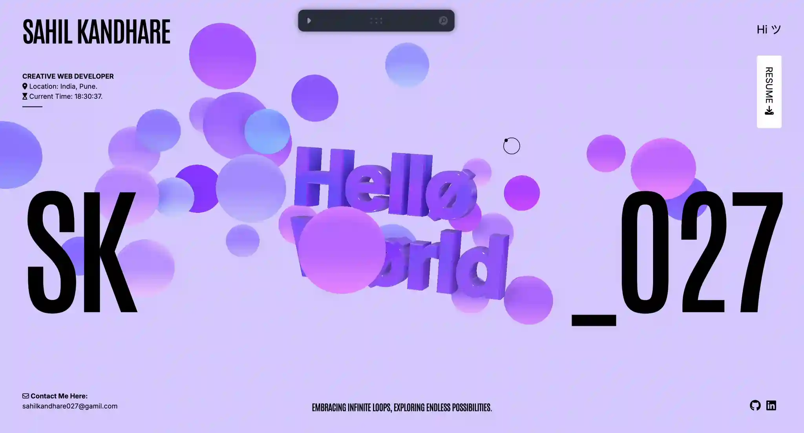</a> ⎯⎯⎯⎯ <strong>Hello World</strong> <a href="https://github.com/SahilK-027/hello-world-r3f">Code</a> · <a href="https://sk027v2.vercel.app/">Live</a></td>
</tr>
<tr>
<td align="center"><a href="https://watercolor-sk027.vercel.app/">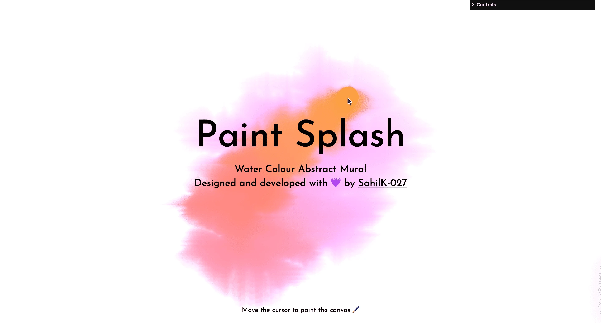</a> ⎯⎯⎯⎯ <strong>Water Color</strong> <a href="https://github.com/SahilK-027/water-color">Code</a> · <a href="https://watercolor-sk027.vercel.app/">Live</a></td>
<td align="center"><a href="https://trinity-2024.vercel.app/">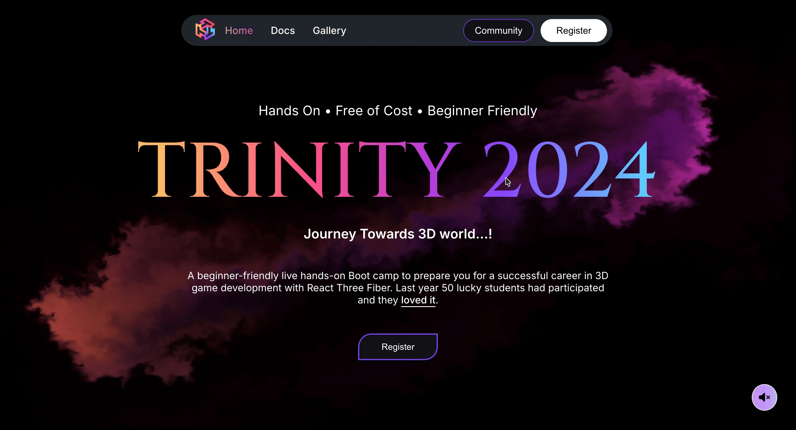</a> ⎯⎯⎯⎯ <strong>Trinity 2024</strong> <a href="https://trinity-2024.vercel.app/">Live</a></td>
<td align="center"><a href="https://assemblescript.vercel.app/">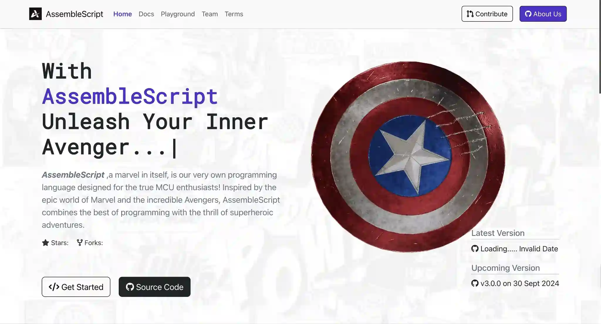</a> ⎯⎯⎯⎯ <strong>Assemble Script</strong> <a href="https://github.com/AssembleProgramming/AssembleScript">Code</a> · <a href="https://assemblescript.vercel.app/">Live</a></td>
</tr>
<tr>
<td align="center"><a href="https://trinity-2023.vercel.app/">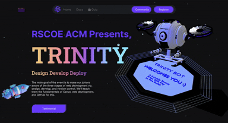</a> ⎯⎯⎯⎯ <strong>Trinity 2023</strong> <a href="https://github.com/SahilK-027/Trinity-2023">Code</a> · <a href="https://trinity-2023.vercel.app/">Live</a></td>
<td align="center">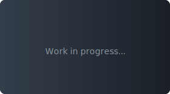 ⎯⎯⎯⎯ <strong>Coming Soon</strong> <a href="https://https://github.com/SahilK-027">Stay tuned<a></td>
<td align="center"> ⎯⎯⎯⎯ <strong>Coming Soon</strong> <a href="https://https://github.com/SahilK-027">Stay tuned<a></td>
</tr>
</table>
<!-- PROJECT-TABLE-END -->
